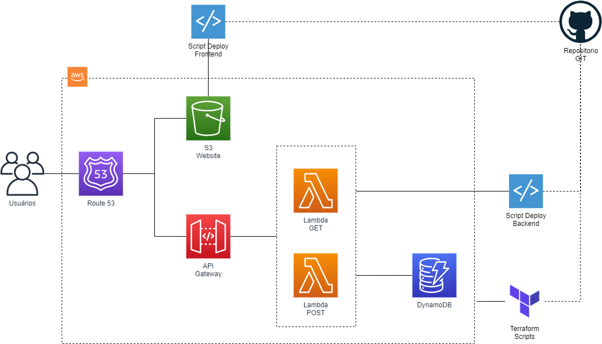

# GFT - Dojo IaC

Repositório utilizado para o Dojo de IaC realizado no dia 23/03/2012

Link apresentação: _Em breve_

## Arquteitura

O objetivo é demonstrar a criação de uma aplicação 3 camadas utilizando 100% IaC com Terraform para provisionar a infraestrutura na AWS

## Roteiro

1. Explicação do que é IaC
1. Apresentação do Dojo Kata
1. Apresentação do problema
1. Mão na massa!
1. Testes e mais testes
1. Validar a aplicação rodando
1. Retrospectiva
1. Duvidas
1. Proximos passos
    * Troposhpere
    * AWS CDK

## Links e Referências

* [AWS: Free Tier](https://aws.amazon.com/free/)
* [AWS: CLI](https://docs.aws.amazon.com/cli/latest/userguide/cli-chap-welcome.html)
* [AWS: Route 53](https://aws.amazon.com/route53/)
* [AWS: API Gateway](https://aws.amazon.com/api-gateway/)
* [AWS: S3](https://aws.amazon.com/s3/)
* [AWS: Lambda](https://aws.amazon.com/lambda/)
* [AWS: DynamoDB](https://aws.amazon.com/dynamodb/)
* [AWS: CDK](https://aws.amazon.com/cdk/)
* [Terraform: CLI](https://www.terraform.io/downloads.html)
* [Terraform: Documentação registry AWS](https://registry.terraform.io/providers/hashicorp/aws/latest/docs)
* [Python: Boto3](https://boto3.amazonaws.com/v1/documentation/api/latest/index.html)
* [Python: Troposphere](https://github.com/cloudtools/troposphere)
* [GFT: Live IaC](https://www.youtube.com/watch?v=IRmMEj0s84I)
* [GFT: Webinar IaC](https://www.youtube.com/watch?v=8iSoP_92fS8)